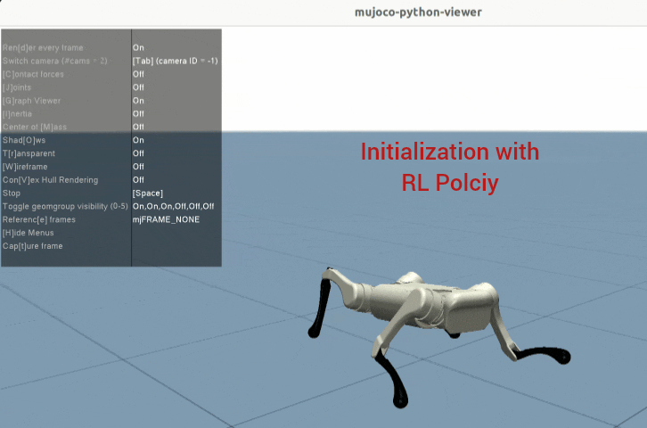

# Prompt a Robot to Walk with Large Language Models

This project is LLM-Based Control for Autonomous Robot Navigation, inspired by [Paper](https://arxiv.org/abs/2309.09969) Currently working on inference delay optimization for LLM, and extending this work to implement on Humanoid robot.




## Setup

### Create conda env:

```shell
conda create -n prompt2walk python=3.9
conda activate prompt2walk
```

### Requirements

```shell
pip install -r requirements.txt
```

## Usage

### Configuration

Please fill the `openai.api_key` in `src/llm.py`.

### Collect the trajectory from the LLM controller

```shell
python src/run.py
```


## Training your own policy

Please refer to [Isaac Lab RL Framework for A1 Quadruped](https://github.com/isaac-sim/IsaacLab/tree/main/source/isaaclab_tasks/isaaclab_tasks/manager_based/locomotion/velocity/config/a1).

